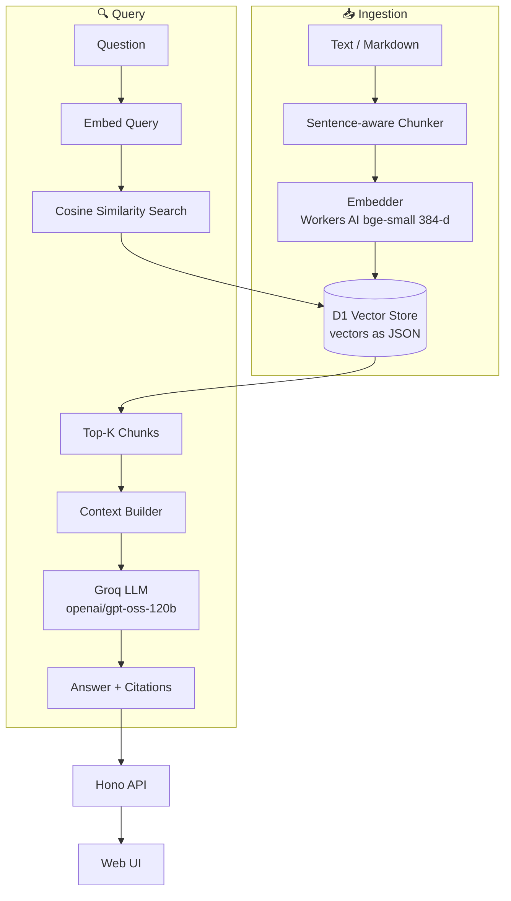

# 01 — Vanilla RAG (Cloudflare Workers)

**Project 01 of 50 — AI Engineering Portfolio**

A production-style **Retrieval-Augmented Generation** system built from scratch on **Cloudflare Workers**. It demonstrates the entire RAG pipeline with no RAG framework: document ingestion → sentence-aware chunking → embeddings → vector search → grounded LLM generation with citations.

## 🌐 Live Demo

| Service | URL |
|---------|-----|
| **App (UI + API)** | https://vanilla-rag.deepvision-aiportfolio.workers.dev |
| **Health** | https://vanilla-rag.deepvision-aiportfolio.workers.dev/api/health |
| **GitHub** | https://github.com/deepvisionkararhaider-crypto/vanilla-rag |

> Verified live: `POST /api/query` returns a real LLM answer with source citations.

## 🎯 Problem

LLMs hallucinate, have a fixed knowledge cutoff, and cannot see your private documents. **RAG** grounds the model's answer in retrieved passages from your own corpus and returns citations so a human can verify every claim.

## 🏗️ Architecture



## ✨ Features

- **Multi-format ingestion** — plain text & Markdown (paste or file upload)
- **Sentence-aware chunking** with configurable size + overlap
- **Embeddings** — Cloudflare **Workers AI** `@cf/baai/bge-small-en-v1.5` (384-d), no external embedding cost
- **Vector search** — exact cosine similarity over vectors stored in **Cloudflare D1**
- **LLM generation** — **Groq** (OpenAI-compatible) with a strict grounding system prompt
- **Citations** — every answer cites `[Source N]` with filename, chunk index, and similarity score
- **Provider abstraction** — LLM endpoint/model configurable via env vars
- **Error handling** — malformed JSON, empty query, oversize documents, empty retrieval
- **Tests** — end-to-end smoke tests (`tests/smoke.sh`)

## 🛠️ Tech Stack

| Layer | Technology |
|-------|-----------|
| Runtime | Cloudflare Workers |
| Framework | Hono |
| Embeddings | Cloudflare Workers AI (BGE-small) |
| Vector store | Cloudflare D1 (SQLite) |
| LLM | Groq (OpenAI-compatible API) |
| Frontend | HTML + TailwindCSS + vanilla JS |

## 📁 Structure

```
01-vanilla-rag/
├── src/
│   ├── worker.js      # Hono app: API + UI
│   └── core.js        # chunking, embeddings, cosine, Groq client, D1 schema
├── tests/smoke.sh     # end-to-end API tests
├── .github/workflows/ci.yml
├── wrangler.jsonc
├── .env.example
└── README.md
```

## 🔑 Environment Variables

```bash
GROQ_API_KEY=        # Groq API key (secret) — https://console.groq.com
LLM_MODEL=openai/gpt-oss-120b
```

Set the secret in production:

```bash
echo "$GROQ_API_KEY" | npx wrangler secret put GROQ_API_KEY
```

## 🚀 Running Locally

```bash
npm install
echo "GROQ_API_KEY=your_key" > .dev.vars
npm run dev            # http://localhost:8787
BASE=http://localhost:8787 bash tests/smoke.sh
```

Local `wrangler dev` uses a local SQLite copy of D1 and the remote Workers AI binding.

## 📡 API

| Method | Endpoint | Description |
|--------|----------|-------------|
| GET | `/api/health` | Health check |
| GET | `/api/stats` | Document/chunk counts |
| GET | `/api/documents` | List documents |
| POST | `/api/documents` | Ingest `{filename, text}` |
| DELETE | `/api/documents/:id` | Delete a document |
| POST | `/api/search` | Semantic search only `{query, top_k}` |
| POST | `/api/query` | RAG query → answer + citations |

Example:

```bash
curl -X POST https://vanilla-rag.deepvision-aiportfolio.workers.dev/api/query \
  -H 'Content-Type: application/json' \
  -d '{"query":"What problem does RAG solve?"}'
```

## 🧪 Testing

```bash
BASE=http://localhost:8787 bash tests/smoke.sh
# 7 tests: health, stats, ingest, chunk count, search, malformed input, query
```

**Verified result:** `7 passed, 0 failed`

## 📊 Performance

Measured on the live Worker (single query, BGE-small embeddings + Groq):

| Metric | Value |
|--------|-------|
| Retrieval | reported per-request in `retrieval_time_ms` |
| Generation | reported per-request in `generation_time_ms` |
| Total | reported per-request in `total_time_ms` |

Not independently benchmarked at scale yet.

## 🐳 Deployment

```bash
npx wrangler deploy
echo "$GROQ_API_KEY" | npx wrangler secret put GROQ_API_KEY
```

D1 migration is applied automatically on first request (idempotent `CREATE TABLE IF NOT EXISTS`).

## 🔮 Future Improvements

- Hybrid retrieval (BM25 + dense)
- Reranking with a cross-encoder
- Multi-query retrieval
- Approximate ANN index (Vectorize) at scale
- Streaming responses

## 📄 License

MIT.
